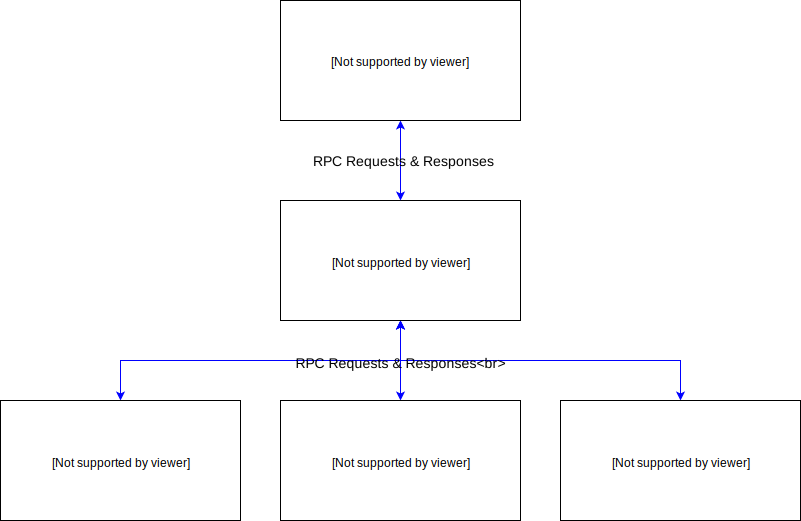

Language Toolbox
================

Language Toolbox is a [Docker](https://www.docker.com/)-based microservice that provides multi-language source code processing and analysis functionality for consumption by user-facing tools and applications. Functionality is exposed via Google's [gRPC framework](https://grpc.io/) and includes the following features:

- Generating Abstract Syntax Trees (ASTs) in JSON format
- Performing [JSONPath](http://goessner.net/articles/JsonPath/)-based pattern matching against ASTs
- Performing regex-based I/O matching
- Running unit tests

The following programming languages are supported:

- C/C++
- C#
- Java
- Javascript
- Python

For more details of which features are supported for which programming languages, see the feature support matrix in the [Making RPC requests](#making-rpc-requests) section below.


## Contents

- [Installation](#installation)
    - [Using the prebuilt Docker images](#using-the-prebuilt-docker-images)
    - [Building the Docker images from source](#building-the-docker-images-from-source)
- [Usage](#usage)
    - [Starting the server](#starting-the-server)
    - [Connecting to the server](#connecting-to-the-server)
    - [Making RPC requests](#making-rpc-requests)
- [Development](#development)
    - [Server architecture](#server-architecture)
    - [Using the development Docker image](#using-the-development-docker-image)
    - [Running the server unit tests](#running-the-server-unit-tests)
    - [Generating the documentation](#generating-the-documentation)
    - [Adding new language modules](#adding-new-language-modules)
    - [Adding new processing features](#adding-new-processing-features)
- [License](#license)


## Installation

### Using the prebuilt Docker images

To install Language Toolbox, simply pull the prebuilt images for the server and its accompanying language-specific sandboxes from [Docker Hub](https://hub.docker.com/u/adamrehn/):

```
docker pull adamrehn/language-toolbox
docker pull adamrehn/language-toolbox-sandbox-cxx
docker pull adamrehn/language-toolbox-sandbox-csharp
docker pull adamrehn/language-toolbox-sandbox-java
docker pull adamrehn/language-toolbox-sandbox-javascript
docker pull adamrehn/language-toolbox-sandbox-python
```

### Building the Docker images from source

To build the Docker images from source, run the following commands in the `docker` directory:

```
./build-sandboxes.sh
./build-production.sh
```

For details on building the development version of the server image, see the section [Using the development Docker image](#using-the-development-docker-image).


## Usage

### Starting the server

If you are using the production Docker image, simply run the server using the following command:

```
docker run --rm -d -p 50051:50051 -v /var/run/docker.sock:/var/run/docker.sock adamrehn/language-toolbox
```

Note the use of the `-v` switch, which bind-mounts the Docker socket from the host into the container so that it can then launch other containers. This allows the sandbox containers to be launched as sibling containers on the host as opposed to nested containers using Docker-in-Docker, [which is problematic and best avoided](http://jpetazzo.github.io/2015/09/03/do-not-use-docker-in-docker-for-ci/).

By default the gRPC server listens on port 50051, but this can be mapped to a different port on the host by modifying the argument of the `-p` switch in the command above.

If you are using the development Docker image, see the section [Using the development Docker image](#using-the-development-docker-image).

### Connecting to the server

The service definition for the gRPC server can be found in [server/proto/server.proto](./server/proto/server.proto). Simply use `protoc` to generate the gRPC stub code for your preferred language, connect to the server on whichever port you have configured it to listen on (default is 50051), and start making RPC requests. For details on this process, see the [gRPC Quick Start Guide](https://grpc.io/docs/quickstart/) for your programming lanuage.

### Making RPC requests

**The list of available RPC methods and their associated request and response data can be found in [the API Documentation](./documentation/documentation.md).**

Each RPC method exposed by the Language Toolbox server (with the exception of the [ListCapabilities](./documentation/documentation.md#listcapabilities-rpc) method) requires that a programming language be specified, so that the appropriate language module can be utilised to handle the request. The following table lists the identifiers and supported processing features for each programming language:

|Supported Features                      |C/C++ |C#       |Java   |Javascript   |Python   |
|----------------------------------------|------|---------|-------|-------------|---------|
|Language Identifier (pass this to RPCs) |`cxx` |`csharp` |`java` |`javascript` |`python` |
|AST Generation and Matching             |Yes   |Yes      |Yes    |Yes          |Yes      |
|I/O Matching                            |Yes   |Yes      |Yes    |Yes          |Yes      |
|Unit Testing                            |Yes   |Yes      |Yes    |Yes          |Yes      |

If you are running the development Docker image and have not built all of the language modules, only those modules that have been built will be available. You can retrieve the list of available languages and their associated processing capabilities by calling the aforementioned `ListCapabilities` RPC method.


## Development

This section contains information for developers who would like to modify or contribute to the code of the Language Toolbox server itself.

### Server architecture

The following diagram depicts a high-level overview of the Language Toolbox server architecture:



The Language Toolbox server consists of two key components:

- **Server Core**: the server core module is a TypeScript gRPC server implementing the `Server` service defined in [server/proto/server.proto](./server/proto/server.proto). The server core spawns the child processes for each of the language modules contained in the `server/languages` directory and interacts with them via gRPC requests. The server core implements all common (i.e. language-agnostic) functionality, including managing the execution of Docker sandbox containers.
- **Language Modules**: each supported programming language is represented by a language module, typically written in the target programming language itself. Each language module is gRPC server implementing the `LanguageModule` service defined in [server/proto/language.proto](./server/proto/language.proto) and handles all language-specific functionality, such as analysing source code and performing codegen to produce executables that will be run in the Docker sandbox container for the programming language.

### Using the development Docker image

#### Building and running the image

To build the development version of the server Docker image, run the following command in the `docker` directory:

```
./build-development.sh
```

You can then launch an interactive shell in the development image by running:

```
./run-development.sh
```

This will spawn an instance of the development image and launch a bash shell. The script invokes Docker with the appropriate arguments to make development as easy as possible:

- The gRPC port will be exposed to the host.
- The root of the source tree will be bind-mounted as `/opt/toolbox` so that changes from the host filesystem will be reflected without needing to restart the container.
- All of the build scripts from the [docker/production/build](./docker/production/build) directory will be available in the system PATH, so that individual server components can be quickly and easily rebuilt.

Only one instance of the development image can be running at any given time. Subsequent invocations of `./run-development.sh` will launch additional bash shells within the currently running container. When the bash shell that launched the container exits, the container will stop and any additional bash shells that have been attached to it will be automatically terminated.

#### Starting the server

The first time you run the development image, you will need to run `build-all.sh` to perform the initial build of the server components. **Note that the build uses the host filesystem that has been bind-mounted into the container, so some of the generated files will be owned by root and may require `sudo` to remove before you will be able to rebuild the production Docker image.** Once the server components are built, start the server by running the core module with the following command in the `/opt/toolbox/server/core` directory:

```
npm run start
```

The server core will automatically spawn each of the language modules as child processes, ignoring any modules that have not been built.

### Running the server unit tests

A Python-based testing framework for the server is provided in the `test` directory. Before running the tests, you will need to install the prerequisites and build the test harness:

```
pip3 install -r requirements.txt
python3 ./build.py
```

Once the test harness is built and you have started the server, you can then run the tests by invoking the script `runtests.py`. If you mapped the server to a port other than the default of 50051, you will need to provide the correct port number to the test script using the `--port` switch.

By default, all of the test suites (stored as JSON files in the `test/tests` directory) will be run, but you can specify an individual test suite like so:

```
python3 ./runtests.py --suite ast_generation
```

This will run only the tests described in the file `test/tests/ast_generation.json`.

### Generating the documentation

The API documentation is generated by the Python script `documentation/generate.py`. The script parses the .proto files in the `server/proto` directory and generates markdown based on the comments found in the message and service definitions. If you modify any of the .proto files, be sure to run the script to re-generate the documentation.

### Adding new language modules

**Note: the Language Toolbox server core is only designed to work with language modules that implement the [LanguageModule gRPC service](./documentation/documentation.md#languagemodule-service). Before attempting to implement a module for a new programming language, be sure to check the [list of languages supported by gRPC](https://grpc.io/about/#osp). If your chosen language is not supported, you will need to implement a gRPC server in one of the supported languages to wrap your underlying implementation.**

Each language module is represented by a subdirectory of the `server` directory. By convention, each module's subdirectory has the same name as the language identifier returned by the module's [GetCapabilities](./documentation/documentation.md#getcapabilities-rpc) RPC method. The only requirement regarding filesystem layout is that the subdirectory contains a `module.json` file in its root. This JSON file must conform to the `ModuleDescriptor` message type defined in [server/proto/language.proto](./server/proto/language.proto). The comments in the .proto file explain the required fields and their contents.

In addition to adding the subdirectory containing the language module itself, the following changes are required:

- A dependency installation script needs to be added in the `docker/production/build` directory with the name `build-language-LANGUAGENAME.sh` (where `LANGUAGENAME` is the language identifier)
- A module build script needs to be added in the `docker/production/deps` directory with the name `deps-language-<LANGUAGENAME>.sh` (where `LANGUAGENAME` is the language identifier)
- If the module supports codegen, a sandbox Docker image needs to be created with a Dockerfile in a subdirectory of the `docker/sandboxes` directory, and the file [docker/build-sandboxes.sh](./docker/build-sandboxes.sh) needs to be updated to add the new sandbox to the list.

Once the gRPC server for the language module is working and at least one processing capability has been implemented, the appropriate unit tests should also be added to the test harness described in the section above.

### Adding new processing features

Adding a new processing feature requires changes to numerous parts of the codebase:

- A new member needs to be added to the `Capabilities` enum defined in [server/proto/common.proto](./server/proto/common.proto).
- A new internal RPC method needs to be added to the `LanguageModule` service defined in [server/proto/language.proto](./server/proto/language.proto).
- All relevant language modules needs to be updated to implement the new RPC method and report the new enum value in their `GetCapabilities` method.
- A new client-facing RPC method needs to be added to the `Server` service defined in [server/proto/server.proto](./server/proto/server.proto).
- The server core needs to be updated to implement the new RPC method and should implement any common functionality that does not need to be replicated in each language module.
- The feature list and feature support matrix in this README need to be updated to add the new processing feature.


## License

Copyright &copy; 2018, Adam Rehn. Licensed under the MIT License, see the file [LICENSE](./LICENSE) for details.
